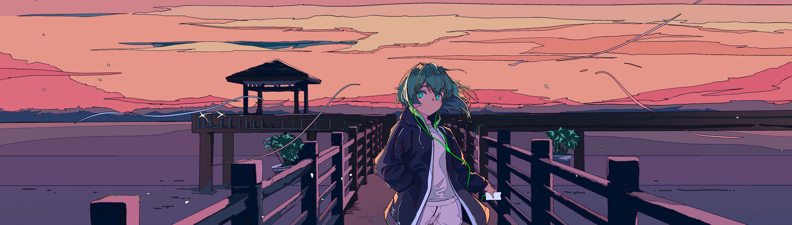

<div align=center>
 
</div>

# はじめまして! 👋 
Enterprise Integration Developer, Illustrator, and Game Developer

I currently work on enterprise integrations using Boomi, JavaScript, SQL for UKG Pro systems and build backend side projects, including game backends, persistence layers, and distributed systems using TypeScript, Python, C#, and AWS.


## 🛠️ Tech Stack & Tools 
- **Languages**
  
  

- **Frameworks & Libraries**
  
  
  
- **Testing**
  
  
  
- **CI/CD & Cloud**
  
  
  
- **Game Development**
  
  
 
- **Creative Tech & UI/UX:**
  
  

<details>
<summary>
  
# 📊 Misc

</summary>

## What I'm doing right now

<p align="center">
  
</p>


## Coding Hours

 <!--START_SECTION:waka-->

```txt
From: 28 January 2023 - To: 18 February 2026

Total Time: 215 hrs 38 mins

PHP              76 hrs 26 mins        ⣿⣿⣿⣿⣿⣿⣿⣿⣶⣀⣀⣀⣀⣀⣀⣀⣀⣀⣀⣀⣀⣀⣀⣀⣀   34.91 %
Java             21 hrs 41 mins        ⣿⣿⣦⣀⣀⣀⣀⣀⣀⣀⣀⣀⣀⣀⣀⣀⣀⣀⣀⣀⣀⣀⣀⣀⣀   09.91 %
Python           20 hrs 5 mins         ⣿⣿⣤⣀⣀⣀⣀⣀⣀⣀⣀⣀⣀⣀⣀⣀⣀⣀⣀⣀⣀⣀⣀⣀⣀   09.18 %
C++              18 hrs 18 mins        ⣿⣿⣄⣀⣀⣀⣀⣀⣀⣀⣀⣀⣀⣀⣀⣀⣀⣀⣀⣀⣀⣀⣀⣀⣀   08.36 %
C#               16 hrs 34 mins        ⣿⣷⣀⣀⣀⣀⣀⣀⣀⣀⣀⣀⣀⣀⣀⣀⣀⣀⣀⣀⣀⣀⣀⣀⣀   07.57 %
```

<!--END_SECTION:waka-->
---

<div align=center>
 <br>
 
</div>
