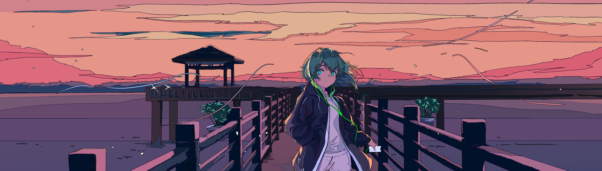

<div align=center>
 
</div>

# はじめまして! 👋 
Enterprise Integration Developer, Illustrator, and Game Developer

I currently work on enterprise integrations using Boomi, JavaScript, Groovy, SQL for UKG Pro systems and build fun side projects, including game backend systems, agentic AI agents, and dev tools using TypeScript, Python, C#, AWS, and GCP.


# 🛠️ Tech Stack & Tools 
- **Languages**
  
  

- **Frameworks & Libraries**
  
  
  
- **Testing**
  
  
  
- **CI/CD & Cloud**
  
  
  
- **Game Development**
  
  
 
- **Creative Tech & UI/UX:**
  
  

<details>
<summary>
  
# 📊 Misc

</summary>

## What I'm doing right now

<p align="center">
  
</p>


## Coding Hours

 <!--START_SECTION:waka-->

```txt
From: 28 January 2023 - To: 15 March 2026

Total Time: 227 hrs 13 mins

PHP              76 hrs 26 mins        ⣿⣿⣿⣿⣿⣿⣿⣿⣤⣀⣀⣀⣀⣀⣀⣀⣀⣀⣀⣀⣀⣀⣀⣀⣀   33.15 %
C#               26 hrs 21 mins        ⣿⣿⣷⣀⣀⣀⣀⣀⣀⣀⣀⣀⣀⣀⣀⣀⣀⣀⣀⣀⣀⣀⣀⣀⣀   11.43 %
Java             21 hrs 41 mins        ⣿⣿⣤⣀⣀⣀⣀⣀⣀⣀⣀⣀⣀⣀⣀⣀⣀⣀⣀⣀⣀⣀⣀⣀⣀   09.41 %
Python           20 hrs 5 mins         ⣿⣿⣄⣀⣀⣀⣀⣀⣀⣀⣀⣀⣀⣀⣀⣀⣀⣀⣀⣀⣀⣀⣀⣀⣀   08.71 %
C++              18 hrs 18 mins        ⣿⣿⣀⣀⣀⣀⣀⣀⣀⣀⣀⣀⣀⣀⣀⣀⣀⣀⣀⣀⣀⣀⣀⣀⣀   07.94 %
```

<!--END_SECTION:waka-->
---

<div align=center>
 <br>
 
</div>
